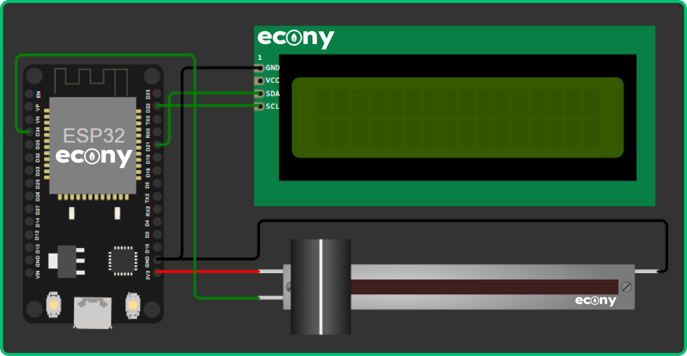
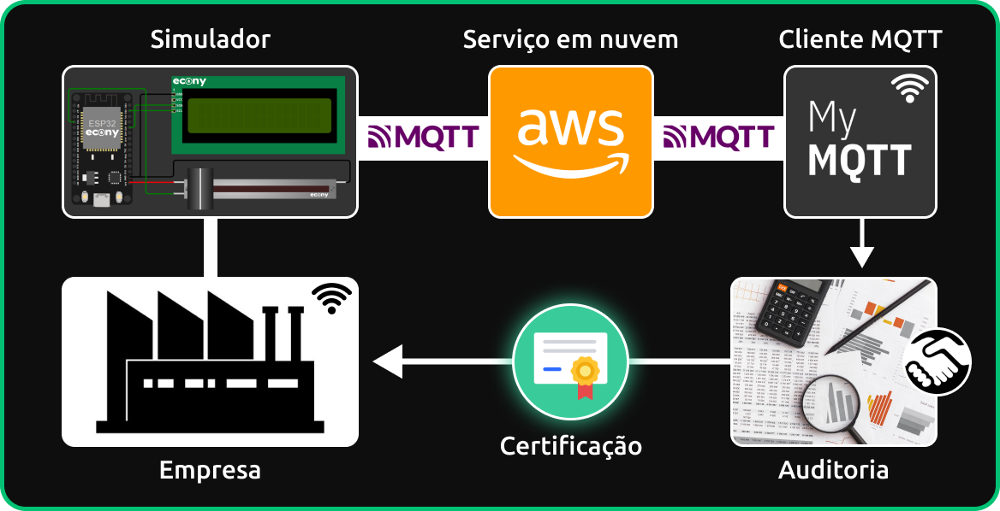

# INTEGRANTES
- **[Guilherme Santos Nunes](https://github.com/sannunez)** | 558989
- **[Kaique Zaffarani](https://github.com/Z4ffarani)** | 556677

## LINKS
- **[VÍDEO EXPLICATIVO](https://youtu.be/2ojkb-5r94c)**
- **[SIMULADOR](https://wokwi.com/projects/414372914280213505)**

<br>

# PROJETO
Este projeto apresenta um plano de certificação sustentável desenvolvido pela fictícia empresa Econy. A solução integra tecnologias de IoT (internet das coisas) e serviços em nuvem para monitorar e validar emissões de CO2 de clientes, incentivando práticas empresariais sustentáveis.

O simulador utiliza um potenciômetro para medir dados relacionados às emissões de CO2 (dióxido de carbono), exibindo-os em um LCD (display de cristal líquido). Esses dados são enviados para um serviço em nuvem por meio de uma conexão Wi-Fi, utilizando o protocolo MQTT. O serviço em nuvem processa e encaminha os dados para um cliente MQTT, facilitando auditoria realizada por terceiros.

O plano é dividido em cinco etapas:

- **Simulador** | Conecta um potenciômetro e um LCD a um microcontrolador, que transmite os dados captados para o serviço em nuvem por meio do protocolo MQTT.

- **Serviço em nuvem** | Máquina virtual configurada para receber, processar e encaminhar os dados do simulador para o cliente MQTT.

- **Cliente MQTT** | Aplicativo que publica e inscreve em tópicos MQTT predefinidos, permitindo que os dados enviados pelo simulador sejam visualizados em tempo real.

- **Auditoria** | Empresa terceirizada que valida os dados coletados, aplicando protocolos rigorosos aprovados por normas nacionais ou internacionais.

- **Certificação** | Emissão de um certificado que comprova o compromisso sustentável da empresa, gerando maior credibilidade no mercado em que atua.

<br>

# INSTRUÇÕES
1. Em um terminal, clonar o repositório:
```bash
git clone https://github.com/Z4FFARANI-EDUCATIONAL/SEM2-GS-EDGE-COMPUTING-AND-COMPUTER-SYSTEMS.git
```

2. No terminal, navegar até a pasta do projeto:
```bash
cd SEM2-GS-EDGE-COMPUTING-AND-COMPUTER-SYSTEMS
```

3. O projeto [IoThunder](https://github.com/Z4ffarani/IoThunder) informa o passo a passo necessário para configurar um serviço em nuvem na AWS (Amazon Web Services).

4. Para rodar o simulador, seguir o link disponibilizado e clicar no botão de iniciar. Levará algum tempo até que o simulador se conecte à rede pública do Wokwi (simulador de eletrônica online) e ao serviço em nuvem. É possível regular o potenciômetro para registrar valores que serão exibidos no LCD e para o cliente MQTT. Para utilização do simulador físico, é necessário executar o código presente no arquivo `simulator.ino` na pasta `docs`, assim como instalar as bibliotecas dos sensores presentes na pasta `libraries`. O programa [Arduino IDE](https://www.arduino.cc/en/software) é adequado para o teste.

5. A auditoria deve instalar o [cliente MQTT](https://mymqtt.app/en). No aplicativo, os dados serão dispostos a partir da inscrição no tópico MQTT `/iot/co2`.

<br>

# FUNÇÕES
`docs/simulator.ino`:
- **Inclusão de bibliotecas** | Importa as bibliotecas necessárias para a operação do microcontrolador e a comunicação com o sensor/atuador, permitindo o uso de funções específicas.
  
- **Constantes de endereços e credenciais** | Recebe valores que permitem a comunicação com o serviço em nuvem, como rede Wi-Fi e informações específicas.

- **Definição de portas de entrada** | Estabelece as portas digitais e analógicas do microcontrolador que serão usadas para conectar e ler os dados do sensor/atuador, garantindo a correta configuração do hardware.
  
- **Funções de inicialização** | Inicia o módulo Wi-Fi do microcontrolador, o serviço em nuvem e o atuador (LCD).

- **Funções de verificação em loop** | Verifica a conexão do serviço em nuvem e exibe mensagens de status no monitor serial, além de publicar os dados captados pelo potenciômetro e exibir parte deles no LCD do simulador.

- **Leitura de sensor e atuador** | Configura e lê os dados do potenciômetro e do LCD, processando os dados de CO2 em ppm (partes por milhão).

- **Envio de dados** | Funções reconhecem o nível do potenciômetro e o enviam para o serviço em nuvem por meio do tópico MQTT `/iot/co2`, que por sua vez envia outros tipos de dados para o cliente MQTT e para o LCD.

<br>

# DIAGRAMA


<br>

# OBSERVAÇÕES
- O projeto é destinado a fins acadêmicos, sendo inteiramente prototipado e validado em ambiente controlado. A responsabilidade pela experimentação real é do usuário.

- A estabilidade da conexão Wi-Fi é fundamental para o funcionamento do sistema. Para o simulador físico, é preciso confirmar que o microcontrolador está dentro do alcance da rede sem fio para garantir a transmissão confiável de dados.

- A instalação do simulador no estabelecimento contemplado é realizada pela Econy, sendo hardware e software configurados corretamente.

- Além de ser terceirizado, o processo de auditoria não é inspecionado pela Econy, que apenas fornece os dados captados pelo simulador para a auditoria durante a validação para certificação.

- As manutenções periódicas do simulador estão incluídas em plano.

- Dependendo dos requisitos específicos de cada certificação, diferentes tipos de validação podem ser requisitados pela auditoria.

<br>

# TECNOLOGIAS
[](https://www.arduino.cc/en/software)
[](https://aws.amazon.com)
[](https://ubuntu.com)

<br>

# REFERÊNCIAS
- **[Instalação de bibliotecas no Arduino IDE](https://docs.arduino.cc/software/ide-v1/tutorials/installing-libraries/)**
- **[Medições de dióxido de carbono](https://www.vaisala.com/sites/default/files/documents/CEN-TIA-Parameter-How-to-measure-CO2-Application-note-B211228PT-A.pdf)**
